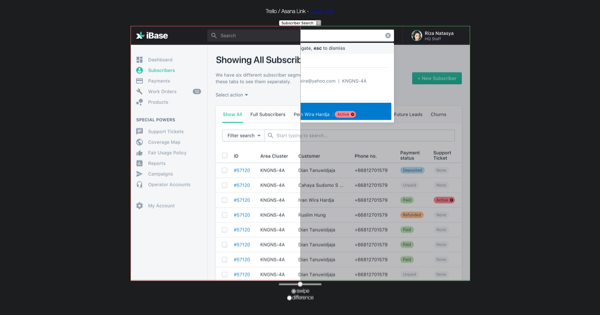

# InterPare 🅱️

InterPare - Compare Interface Design (BETA).

It is a tool I use to-  
* show stakeholders the difference between two UI design screenshots.  
* do design QA testing after developer iterations.  

## Demo

https://musavvirahmed.github.io/InterPare-ALPHA/

## License

MIT
